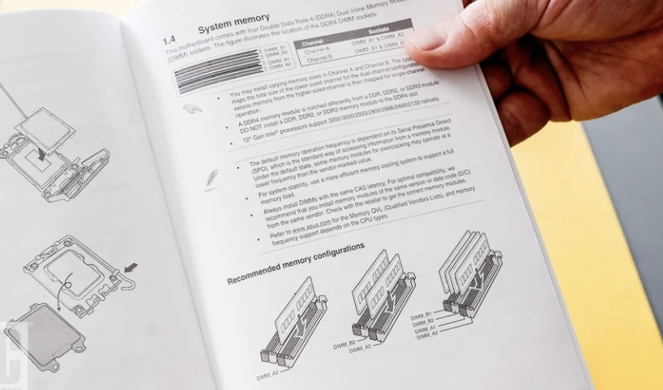
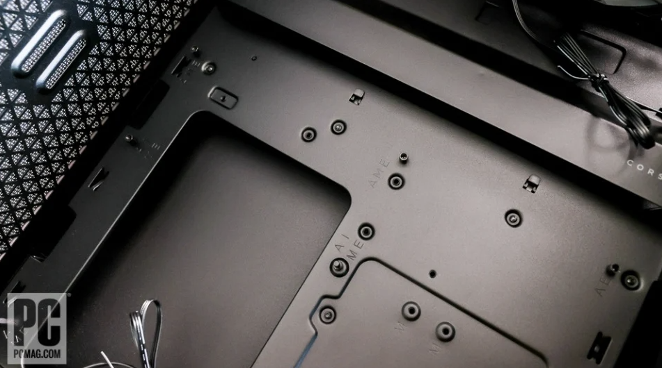
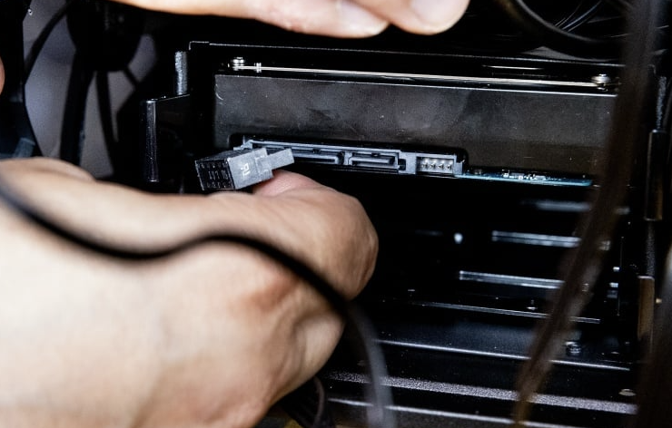

# Assembly
## Preliminaries
Besides the parts that you have chosen, you will also need a basic Phillips (cross head) screwdriver to assemble the PC.

Static buildup is a small concern during PC building, though modern parts are very resilient to static. As a precaution, you can put your parts on wood or boxes instead of carpet, and you can touch metal to discharge any static.

## Steps

### Motherboard
We will assemble the motherboard first.

#### CPU
We will start with the CPU. When installing the CPU, be extremely careful with its flat faces. Try not to touch the pins, as a bent pin will not work and can be difficult to fix. Grab the sides of the cpu, instead.

Find the motherboard’s CPU socket. It should be a framed square with some sort of load lever beside it.

Open the slot by pressing down on the lever and pulling it aside, revealing some pins.

Look for an arrow indicator on the cpu socket. There should be an arrow on your cpu as well. Align the arrows before gently laying down the cpu 
into the sockets, allowing them to lay flush. The CPU should be able to lay flush without any additional force if it is in place correctly.

Finally, close the frame over the CPU before lowering the lever. It may take some pressure to do this, but once it is firmly in place, you are done!

#### RAM
Now, we move to RAM. Find the RAM slots on your motherboard. They should look like flat inserts, typically in sets of two or four (check your motherboard specs).

The slots you want to use will depend on the motherboard. Locate the manual and your motherboard and determine the order in which your RAM should be installed

The slots will have latches that you can pull back on either side. Open the slots you plan on using.

Align the notch in the insert with the notch in the RAM before firmly pressing it down evenly into the slot. There should be an audible click as the levers come back down to secure the stick of RAM.

#### SSD
Now, the SSD. If you are using an M.2 SSD (if your SSD looks like a thin stick), you will want to connect it to your motherboard. To locate the M.2 slot, we are looking for a slot near the cpu. This may be open or it could be covered with a metal band or heat sink.

Using a screwdriver, unscrew the M.2 heat sink and align the notched end of the M.2 drive with the insert slot on the end. Insert the drive at an angle making sure the notch aligns with the slot. There should be a click, and when you let go the slot should hang at a 45 degree angle.

If there was a heatsink attached, you want to remove the plastic on the bottom and screw the heatsink back on to secure your SSD.

If your board did not come with one, you can just screw the other side into the board and leave it be.

### Motherboard into case
For the next steps, we will want to mount the motherboard into the case. The way that they are mounted will depend on the size of the motherboard and case. We recommend that you check with the manual that comes with your case to ensure that you are installing the motherboard correctly.
When you first open up your case, you will see bits or holes for where standoffs are meant to be. Make sure that the standoffs are aligned with the holes in the motherboard. If they are not aligned, remove or add the correct standoffs to fit in your desired motherboard.

Before placing the motherboard in, we want to insert the I/O shield.This is a strip of metal that comes with your motherboard with cut outs matching your board’s ports. This shield will fit into a cutout on the back of the case. Ensure that the ports are oriented so the motherboard faces out and can slot into the ports properly before snapping it into place.

Finally, you can screw your motherboard into place to securely mount the motherboard into your case. Make sure that you screw every standoff hole.

The next step for completely integrating your motherboard is to connect the case cables. These are called the front panel connectors and are important as they correspond to the buttons and ports on the front of the case. They may vary from case to case, so make sure to keep both your motherboard and case manual on hand.

These cables connect to pins on the edge of the motherboard. The manual that comes with your motherboard should provide diagrams for the location of each cable along the front panel pins, and the cables should be labeled so you can easily determine which wire goes where. 

After connecting the front panel connectors, you also have to connect the fans that come with your case. There should be wires coming from all of your case fans which will connect to your motherboard. Consult your motherboard manual to find pins which are labeled, CHA_FAN, SYS_FAN, or something similar. This is where you want to connect the cables from your case fans.

### Cooler
The next step of the process is mounting your CPU cooler. This is the part of the process that will vary the most from computer to computer. Be sure to look at the manual of your specific cooler to ensure that you are following the steps laid out for you. We also recommend looking up videos and reviews of your specific cooler to better understand how the cooler you chose in particular is mounted. In our case we will talk about the implementation of a stock intel cooler.
The stock cooler should come with a tube of thermal paste which you will need to spread over the cpu. It is important that you do not over do it with the thermal paste, a small rice sized amount should be enough.

There should be four holes at the corners of the cpu where the push pins of the cooler will align with. Make sure that they are aligned as you place the cooler on top of your cpu.

Push down on the pins to snap them into place, you should hear an audible click with each pin.

Finally, you want to connect the cable from the CPU fan to the pins labeled CPU_FAN

### PSU
The next step is to install the power supply unit (PSU).
 With power supplies, they come in three different types, fixed-cable, semi-modular, and modular. If you have a fixed-cable PSU, all of the cables are already attached to your power supply, however if you have semi-modular or modular, there may be additional cables that you will need to attach. You will want to attach all of your necessary cables before mounting the power supply into the computer. 

The cables you will need to connect no matter what are the large main power cables under “MOTHERBOARD”. You will also need cables for the CPU (check if your motherboard manual requires one or two). You will also need another cable or two under PCIe if you are installing a GPU. Additionally, you will need to install a SATA cable for each SSD or HDD (not including M.2 SSDs if you have already installed one in the motherboard).

Now we can mount the power supply into our case. In most cases, the power supply will go into a slot in the back where there is a cutout for the outlet in the PSU. Make sure that the fan of the PSU is pointing outside of the case before sliding it into place. (In some cases, there may be a backplate which you will need to unscrew first before sliding the PSU in)

Finally, align the holes in the PSU with the holes in the cutout and screw the PSU into place.

The next steps are to route your power supply cables to their homes. Both the large 24-pin main power connector and the CPU connector will be on the motherboard. Consult your motherboard manual for the proper places, but they should both look the same no matter the motherboard you use. The notched connector only goes in one orientation, and you should hear an audible click when plugging into the motherboard

As for any of the cables for the GPU, route them near the motherboard in preparation for when we attach the GPU later. The same goes for any other SSDs or HDDs which were not already plugged into the motherboard.

### SSDs/HDDs
After we have wired the main components of the PSU, we need to also power and install our SSDs and HDDs. 
In most cases, there should be trays which will be able to house your larger SSDs and HDDs, you will want to remove them from your case and fit your SSD/HDD into the tray. The way they fit will differ from case to case, so consult your cases manual to ensure you are properly fitting your storage device.

Return the tray to the bay where it was retrieved from within the case, making sure that your connector ports are facing outwards.

Once the tray is back in place, we want to connect the SATA power connector from our PSU into its spot. The connector should have an elbow-bend style cable, we want to align this cable with the L-shaped groove in the connector.

Next we need a SATA connecting the drive to the motherboard. Your motherboard should come with SATA cables. These cables can come in either straight or elbow forms and do not make a difference in assembly. These cables only fit in one orientation and should make another audible click when inserted into the drive.

To finish installing the drives, connect the other end of the newly installed SATA cable to one of the SATA ports on your motherboard. The position of the port may vary from motherboard to motherboard, so you should consult your motherboard manual to ensure you connect them correctly.

### GPU
Finally, you are going to want to install your GPU
Before installing the GPU into the GPU socket of your motherboard, you want to make room for your GPU by unscrewing some of the plate covers on the side of the case. There might be multiple slots for GPUs and you want to first plan out where you would like to install your GPU. Consult your motherboard manual for the best slot.

Before you plug the GPU into your desired slot, you will need to remove the back plates from the side of the case which are aligned with the GPU. Unscrew the plates from their positions, opening up space for the side of your GPU.

Now that you have space for your GPU, you want to insert the plugged portion of the GPU into the slot in the motherboard, aligning the notch so that it fits and gives an audible click.

Next, refasten the screws you took from the back plates to lock the GPU back into place.

To finish installing the GPU, connect the leftover PCIe cable or cables from your PSU to your GPU. The slot for the cable is usually on the front of the GPU. Some GPUs will supply and use an adapter for two 8-pin PCIe cables while others will take the PCIe cable directly from the PSU.
Adapter cord for two 8-pin PCIe

Directly routed from PSU:

### Done!
It’s finally finished! You might want to consider rerouting your cables around after it has come together to make it a bit neater, but your computer should now be fully functional.