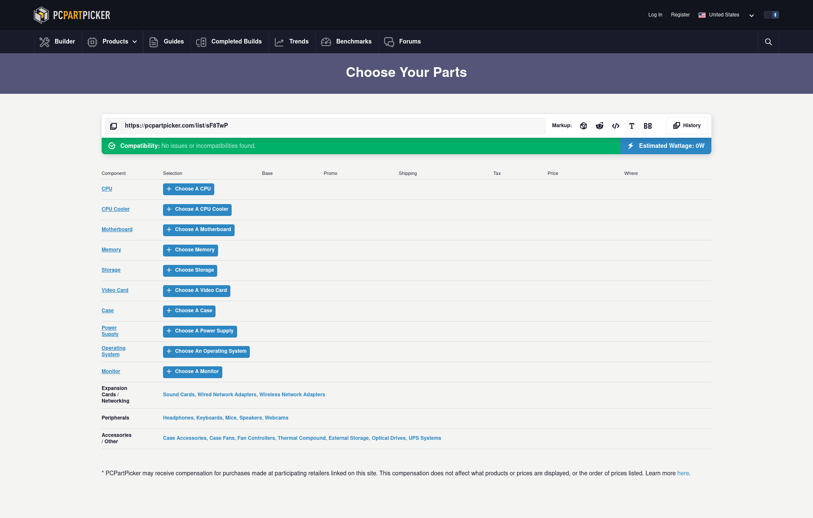

# Vendor

    
    <em style="max-width: fit-content;
        margin-left: auto;
        margin-right: auto;
        display:block;">
        an image of the pcpartpicker ui
    </em>

We recommend using a part building website like <https://pcpartpicker.com/list/> to plan your build as you work through this guide. It’ll help you double check for part incompatibilities, keep track of your decisions, and find part specifications in a consistent interface. pcpartpicker also compiles a list of vendors and keeps a history of part prices.
